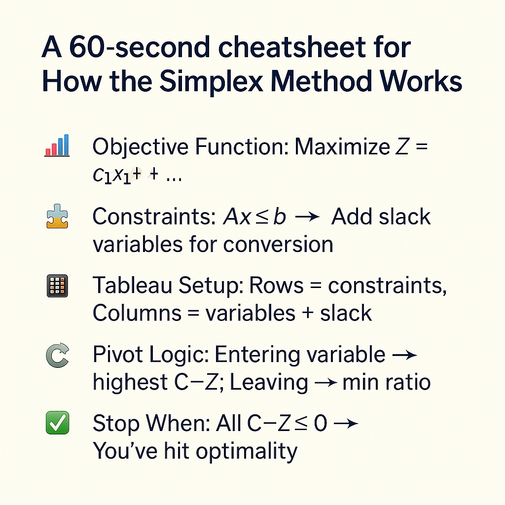
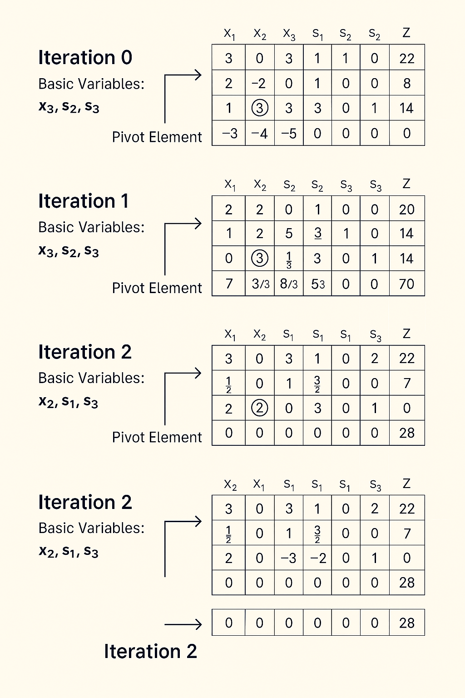

# 🧮 Simplex Problem 1

Welcome to my first Linear Programming walkthrough using the **Simplex Method**. This manually solved problem decodes optimization with clear tableau logic, pivot decisions, and visual assets—perfect for learners and professionals looking to reinforce LP fundamentals.

---

## 🧩 Problem Statement

**Objective Function:**  
Maximize Z = x₁ + 4x₂ + 5x₃

**Subject to Constraints:**

| Constraint No. | Equation                      | Slack Variable |
|----------------|-------------------------------|----------------|
| (1)            | x₁ − x₂ + x₃ ≤ 22             | + s₁           |
| (2)            | x₁ + 2x₂ + 3x₃ ≤ 14           | + s₂           |
| (3)            | 3x₁ + 2x₂ ≤ 14                 | + s₃           |

All variables x₁, x₂, x₃ ≥ 0

Converted to canonical form with slack variables:
- x₁ − x₂ + x₃ + s₁ = 22  
- x₁ + 2x₂ + 3x₃ + s₂ = 14  
- 3x₁ + 2x₂ + 0x₃ + s₃ = 14

---

## 📊 Tableau Snapshot

**Initial Tableau (Iteration 0)**

| C<sub>B</sub> | Basis | x₁ | x₂ | x₃ | s₁ | s₂ | s₃ | RHS |
|---------------|-------|----|----|----|----|----|----|-----|
| 0             | s₁    | 3  | 0  | 3  | 1  | 0  | 0  | 22  |
| 0             | s₂    | 1  | 2  | 3  | 0  | 1  | 0  | 14  |
| 0             | s₃    | 3  | 2  | 0  | 0  | 0  | 1  | 14  |

Optimal solution reached after 2 pivot iterations. Full iteration breakdown available in [`iteration_tables.md`](iteration_tables.md)

---

## ✅ Final Solution

| Variable | Value |
|----------|-------|
| x₁       | 0     |
| x₂       | 7     |
| x₃       | 0     |
| s₁       | 22    |
| s₂       | 0     |
| s₃       | 0     |
| Z        | 28    |

For interpretation and pivot reasoning, see [`simplex_notes.md`](simplex_notes.md)

---
## 📷 Visual Walkthrough

  
*Conceptual overview of the Simplex Method.*

  
*Manual tableau transformations across all iterations.*

## 📂 Repository Contents

| File Name               | Purpose                                     |
|------------------------|---------------------------------------------|
| README.md              | Project overview and summary                |
| iteration_tables.md    | Detailed tableau transitions                |
| simplex_notes.md       | Conceptual insights and LP reflections      |
| final_solution.txt     | Summary of optimal values and basis         |
| tableau_flow.png       | Visual: pivot flow across iterations        |
| simplex_cheatsheet.png | Conceptual guide for LP structure           |
| project_banner.png     | Branded header image for GitHub/LinkedIn    |

---

## 🛠️ Run It Yourself

```bash
# Clone the repo
git clone https://github.com/Gyanankur23/Simplex-Problem-1.git

# View markdown walkthroughs
cd Simplex-Problem-1
